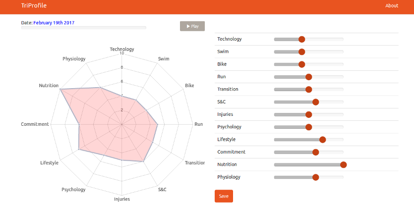

Triathlon Profile
=================

Check it out here: https://coderrik.github.io/triathlon-profile/.

Move the sliders to set your current performance levels and click Save to generate a bookmark with a 5-letter code. Keep this bookmark - it refers to your data. Revisit this site, using your bookmark, and update and save your performance levels as you improve. Once you have a couple of saves, you can click Play and watch your progress.
